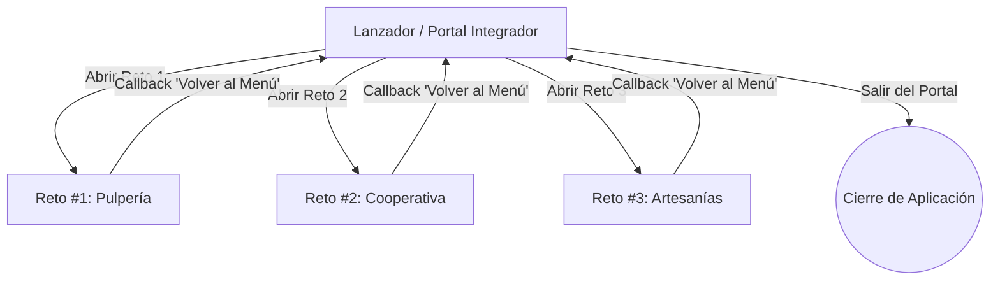

# Sistema Integrador de Retos JavaFX — Equipo WAAS

[](https://adoptium.net/)
[](https://openjfx.io/)
[](https://maven.apache.org/)
[](https://uam.edu.ni/)

Proyecto práctico de aplicación y experimentación (**P.A.E.**) desarrollado para la asignatura de **Programación de Escritorio** en la **Universidad Americana (UAM)**.

El sistema consolida tres aplicaciones de escritorio en JavaFX bajo una arquitectura modular gobernada por un **Portal Integrador**, implementando buenas prácticas de desarrollo: manejo avanzado de eventos (`ActionEvent`, `KeyEvent`, `MouseEvent`), separación de responsabilidades (MVC/FXML), patrones de persistencia (`DAO`, `CRUD`), menús multinivel, barras de herramientas, validación de datos y navegación desacoplada mediante *callbacks*.

---

## 📋 Tabla de Contenidos
1. [Descripción del Sistema y Arquitectura](#-descripción-del-sistema-y-arquitectura)
2. [Módulos del Proyecto](#-módulos-del-proyecto)
   - [Portal Menú Integrador](#1-portal-menú-integrador-menuintegrador)
   - [Reto #1: Inventario de Pulpería](#2-reto-1-inventario-de-pulpería)
   - [Reto #2: Cooperativa de Lotes de Granos](#3-reto-2-cooperativa-de-lotes-de-granos)
   - [Reto #3: Tienda de Artesanías Nicaragüenses](#4-reto-3-tienda-de-artesanías-nicaragüenses)
3. [Requisitos Previos](#-requisitos-previos)
4. [Cómo Compilar y Ejecutar el Proyecto](#-cómo-compilar-y-ejecutar-el-proyecto)
   - [Opción 1: Ejecución Rápida con Script Automatizado (Windows)](#opción-1-ejecución-rápida-con-script-automatizado-windows)
   - [Opción 2: Ejecución Manual con Maven](#opción-2-ejecución-manual-con-maven)
   - [Opción 3: Ejecución desde un IDE (IntelliJ IDEA / VS Code)](#opción-3-ejecución-desde-un-ide-intellij-idea--vs-code)
5. [Estructura del Repositorio](#-estructura-del-repositorio)
6. [Técnicas y Patrones de Diseño Aplicados](#-técnicas-y-patrones-de-diseño-aplicados)
7. [Créditos](#-créditos)

---

## 🏛 Descripción del Sistema y Arquitectura

El proyecto está diseñado bajo una estructura **Maven Multi-Módulo**. Un proyecto raíz (`GuiaPractica-Eventos`) orquesta cuatro submódulos independientes:

```
GuiaPractica-Eventos (pom.xml raíz)
 ├── Reto #1 / Reto1     (Inventario básico + KeyEvents)
 ├── Reto2               (Patrón DAO + ContextMenu + Fechas)
 ├── Reto #3 / Reto3     (MenuBar + ToolBar + Ventas + Stock)
 └── MenuIntegrador      (Portal central que orquesta los 3 retos)
```

### Flujo de Navegación y Ciclo de Vida


* Al iniciar la aplicación se presenta el **Portal Integrador**.
* Al abrir cualquier reto, el menú principal se oculta temporalmente (`menuStage.hide()`) y se pasa un callback (`Runnable onVolverAlMenu`) a la ventana secundaria.
* Al pulsar el botón **"← Volver al Menú Principal"** o cerrar la ventana del reto desde la barra de título, el callback cierra el escenario del reto y vuelve a mostrar el menú principal (`menuStage.show()`).

---

## 📦 Módulos del Proyecto

### 1. Portal Menú Integrador (`MenuIntegrador`)

Es el cuadro de mando central que unifica la experiencia de usuario.

* **Características Visuales:**
  * Paleta institucional moderna con tono cian/turquesa (`#0099AB`) y fondo sobrio (`#f8fafc`).
  * Logo vectorial SVG integrado de la Universidad Americana (UAM).
  * Tarjetas de navegación responsivas con efectos de elevación (*hover shadow* y transiciones de borde).
  * Detección dinámica de la versión de Java en tiempo de ejecución.
* **Cómo Usarlo:**
  1. Al abrir el portal, visualice las tarjetas correspondientes a los tres retos disponibles.
  2. Haga clic en el botón **"Abrir Reto #X ➜"** del módulo al que desee acceder.
  3. Para salir de la suite completa, haga clic en el botón rojo **"Salir del Portal"** situado en la esquina inferior derecha; el sistema solicitará una confirmación modal antes de finalizar el proceso.

---

### 2. Reto #1: Inventario de Pulpería

Simula un sistema de control de inventario ágil para una pulpería o tienda de conveniencia local.

* **Conceptos Demostrados:**
  * Manejo de eventos de acción (`ActionEvent`) en botones.
  * Captura de eventos de teclado (`KeyEvent` escuchando la tecla `KeyCode.ENTER`).
  * Validación robusta de tipos de datos en tiempo de entrada.
  * Colección observable reactiva (`ObservableList<Producto>`) sincronizada con un `TableView`.
* **Reglas de Validación:**
  * **Campos vacíos:** Ningún campo puede quedar en blanco.
  * **Precio:** Debe ser un número decimal estrictamente mayor a 0 (ej. `18.50`).
  * **Cantidad/Existencias:** Debe ser un número entero no negativo (>= 0).
* **Guía de Uso Paso a Paso:**
  1. **Registrar un producto nuevo:**
     * Llene los campos: *Código* (ej. `P005`), *Nombre* (ej. `Queso Seco 1lb`), *Precio* (ej. `95.00`) y *Cantidad* (ej. `20`).
     * Haga clic en el botón **"Guardar"**. El producto se agregará de inmediato a la tabla.
  2. **Actualizar un producto existente:**
     * Ingrese el mismo código de un producto ya registrado (ej. `P001`), modifique su precio o existencias y presione **"Guardar"**. El sistema detectará la coincidencia y actualizará la fila correspondiente.
  3. **Consulta rápida por teclado (KeyEvent ENTER):**
     * En el campo superior derecho *"Consulta Rápida de Existencias"*, escriba el código del producto (ej. `P002`) y presione la tecla **ENTER**.
     * La tabla seleccionará y desplazará automáticamente la vista hacia la fila coincidente, mientras una etiqueta inferior indicará en verde las existencias y precio actualizados.
  4. **Limpiar formulario:**
     * Presione el botón **"Limpiar"** para vaciar las cajas de texto y restablecer el mensaje de búsqueda.
  5. **Regresar:**
     * Haga clic en el botón superior **"← Volver al Menú Principal"**.

---

### 3. Reto #2: Cooperativa de Lotes de Granos

Gestiona la recepción y control de lotes agrícolas (café, frijol, maíz, arroz, trigo) mediante arquitectura por capas.

* **Conceptos Demostrados:**
  * Patrón de diseño **DAO (Data Access Object)** implementando una interfaz genérica `CRUD<T>` (`LoteDAO`).
  * Controles avanzados de formulario: `ComboBox<String>` para clasificación y `DatePicker` (`java.time.LocalDate`) para control temporal (fecha de entrega y fecha de caducidad).
  * Eventos avanzados de ratón (`MouseEvent`): detección de **doble clic** (`getClickCount() == 2`) para cargar la información de una fila al formulario.
  * Menú contextual (`ContextMenu`) desplegable con **clic derecho** sobre la tabla para editar o eliminar.
  * Diálogos de confirmación modal (`Alert.AlertType.CONFIRMATION`).
* **Guía de Uso Paso a Paso:**
  1. **Registrar un nuevo lote:**
     * Ingrese el *Código de Lote* (ej. `L-105`), *Producto* (ej. `Café Caturra Lavado`), y *Cantidad (Kilos)* (ej. `250.0`).
     * Seleccione el *Tipo de Grano* en el menú desplegable (Café, Frijol, Maíz, Arroz o Trigo).
     * Seleccione la *Fecha de Entrega* y la *Fecha de Caducidad* usando los selectores de fecha (`DatePicker`).
     * Haga clic en **"Agregar"**.
  2. **Inspección rápida con Doble Clic:**
     * Haga **doble clic** sobre cualquier fila de la tabla; los datos del lote se cargarán inmediatamente en los campos del formulario superior.
  3. **Editar un lote existente:**
     * Tras cargar los datos con doble clic, modifique los valores que desee en el formulario.
     * Haga **clic derecho** sobre la fila seleccionada en la tabla y seleccione **"Guardar Edición"**.
  4. **Eliminar un lote:**
     * Haga clic sobre el lote que desea remover, haga **clic derecho** y seleccione **"Eliminar Lote"**.
     * Confirme la operación en el cuadro de diálogo emergente haciendo clic en **Aceptar**.
  5. **Limpiar y Volver:**
     * Use el botón **"Limpiar"** para reiniciar los campos y selectores.
     * Presione **"← Volver al Menú Principal"** para retornar al portal.

---

### 4. Reto #3: Tienda de Artesanías Nicaragüenses

Aplicación integral para la administración y comercialización de artesanías típicas nicaragüenses (Hamacas de Masaya, Cerámica Negra de Matagalpa, Esculturas de El Güegüense, Fajas de Cuero de Camoapa, Joyería de Filigrana, etc.).

* **Conceptos Demostrados:**
  * Barra de menús multinivel (`MenuBar`) con menús de *Catálogo*, *Ventas* y *Ayuda*.
  * Atajos de teclado del sistema / aceleradores (`Shortcut+N` para nuevo producto, `Shortcut+S` para guardar).
  * Barra de herramientas (`ToolBar`) con accesos rápidos a operaciones frecuentes y buscador integrado.
  * Búsqueda dinámica con coincidencia parcial (busca por código o fragmento del nombre).
  * Lógica de ventas: decremento automático de stock con validación de agotado (stock > 0).
  * Valorización económica en tiempo real: cálculo de unidades físicas y total monetario en Córdobas (C$).
  * Barra de estado inferior (`lblEstado`) reactiva que brinda retroalimentación instantánea de cada acción ejecutada.
* **Guía de Uso Paso a Paso:**
  1. **Registrar o editar artesanías:**
     * Presione `Ctrl+N` (o el botón **"Nuevo"** en la barra de herramientas).
     * Rellene Código, Nombre, Categoría (Textil, Cerámica, Madera, Cuero, Joyería, Otro), Precio unitario y Stock.
     * Presione `Ctrl+S` (o el botón **"Guardar"**). Si el código ya existe, actualizará los datos; si es nuevo, lo anexará al catálogo.
  2. **Cargar artesanía al formulario:**
     * Al hacer clic en cualquier fila del catálogo, sus atributos se proyectan automáticamente en el formulario izquierdo.
  3. **Buscar artesanías:**
     * En el cuadro de búsqueda de la barra de herramientas, escriba un código (ej. `ART-003`) o una palabra clave del nombre (ej. `Hamaca`, `Cuero`, `Cerámica`).
     * Presione **ENTER** o haga clic en **"Buscar"**. La tabla seleccionará la coincidencia y la barra de estado mostrará las existencias y precio.
  4. **Registrar una venta:**
     * Seleccione una artesanía en la tabla y presione el botón verde **"Vender"** de la barra de herramientas (o vaya a *Ventas -> Vender Producto Seleccionado*).
     * El stock se reducirá en 1 unidad automáticamente. Si el producto tiene stock 0, el sistema mostrará un aviso impidiendo la venta.
  5. **Consultar el Resumen Económico del Inventario:**
     * Ingrese al menú superior **Ventas -> Resumen de Inventario**.
     * Se desplegará un informe detallado con:
       * Número de tipos de artesanías registradas.
       * Suma total de unidades físicas en almacén.
       * Valorización económica total del catálogo en Córdobas (`C$`).
  6. **Retorno al Portal:**
     * Puede volver usando el botón **"← Volver al Menú"** de la barra de herramientas o mediante el menú *Catálogo -> ← Volver al Menú Principal*.

---

## 🛠 Requisitos Previos

Antes de ejecutar el proyecto, asegúrese de tener configurado en su equipo:

1. **Java Development Kit (JDK):** Versión **21** o superior (recomendado: [Eclipse Adoptium Temurin 21](https://adoptium.net/temurin/releases/?version=21)).
   ```bash
   java -version
   ```
2. **Apache Maven:** Versión **3.8+** (o utilizar el wrapper `mvnw.cmd` / `./mvnw` incluido en el repositorio).
   ```bash
   mvn -version
   ```
3. **Variable de entorno `JAVA_HOME`:** Apuntando a la instalación de su JDK 21.

---

## 🚀 Cómo Compilar y Ejecutar el Proyecto

### Opción 1: Ejecución Rápida con Script Automatizado (Windows)

El repositorio incluye el script `build-all.bat` en la raíz del proyecto. Este archivo automatiza la compilación e instalación de cada reto en el repositorio local de Maven (`.m2`) y prepara el Menú Integrador.

1. Abra una terminal (PowerShell o CMD) en la raíz del proyecto.
2. Ejecute el script:
   ```cmd
   .\build-all.bat
   ```
3. Una vez finalizado el proceso de instalación, inicie el portal con:
   ```cmd
   cd MenuIntegrador
   .\mvnw.cmd javafx:run
   ```

---

### Opción 2: Ejecución Manual con Maven

Si prefiere compilar paso a paso o se encuentra en Linux/macOS:

1. **Instalar los submódulos de los retos:**
   ```bash
   # Reto 1
   cd "Reto #1/Reto1"
   mvn clean install -DskipTests
   cd ../../

   # Reto 2
   cd Reto2
   mvn clean install -DskipTests
   cd ../

   # Reto 3
   cd "Reto #3/Reto3"
   mvn clean install -DskipTests
   cd ../../
   ```

2. **Ejecutar el Menú Integrador:**
   ```bash
   cd MenuIntegrador
   mvn clean compile javafx:run
   ```

---

### Opción 3: Ejecución desde un IDE (IntelliJ IDEA / VS Code)

1. Abra la carpeta raíz `PAE_Eventos_JavaFX_EquipoWAAS` en su IDE como **Maven Project**.
2. Deje que el IDE sincronice las dependencias del `pom.xml` raíz y de los submódulos.
3. Asegúrese de que el **Project SDK** esté configurado en **Java 21**.
4. Localice y ejecute la clase principal:
   * **Ruta:** `MenuIntegrador/src/main/java/ni/edu/uam/menu/Launcher.java`
   * *(O alternativamente `ni.edu.uam.menu.MenuApplication.java`)*
5. **Ejecución individual:** Si desea ejecutar un reto de forma aislada sin pasar por el portal integrador, puede ejecutar directamente los lanzadores individuales:
   * **Reto 1:** `org.uam.reto1.Launcher` (o `HelloApplication`)
   * **Reto 2:** `ni.edu.uam.reto2.Launcher` (o `LoteApplication`)
   * **Reto 3:** `org.uam.reto2.Launcher` (o `HelloApplication`)

---

## 📁 Estructura del Repositorio

```text
PAE_Eventos_JavaFX_EquipoWAAS/
├── pom.xml                                    # POM agregador raíz (multi-módulo)
├── build-all.bat                              # Script de compilación e instalación local
├── mvnw / mvnw.cmd                            # Maven Wrapper
├── README.md                                  # Documentación del proyecto
│
├── MenuIntegrador/                            # Módulo del Portal Central
│   ├── pom.xml
│   └── src/main/
│       ├── java/
│       │   ├── module-info.java               # Configuración modular JPMS
│       │   └── ni/edu/uam/menu/
│       │       ├── Launcher.java              # Punto de entrada JavaFX desacoplado
│       │       ├── MenuApplication.java       # Ciclo de vida y carga del FXML principal
│       │       └── MenuController.java        # Lógica de navegación y eventos del portal
│       └── resources/ni/edu/uam/menu/
│           └── menu-view.fxml                 # Diseño FXML con logo SVG y tarjetas
│
├── Reto #1/Reto1/                             # Módulo del Reto #1: Inventario de Pulpería
│   ├── pom.xml
│   └── src/main/
│       ├── java/
│       │   ├── module-info.java
│       │   └── org/uam/reto1/
│       │       ├── HelloApplication.java
│       │       ├── HelloController.java       # Manejo de ActionEvent, KeyEvent y validaciones
│       │       ├── Launcher.java
│       │       └── model/Producto.java        # Modelo del producto
│       └── resources/org/uam/reto1/
│           └── hello-view.fxml                # Vista en JavaFX puro (sin .css externo)
│
├── Reto2/                                     # Módulo del Reto #2: Cooperativa de Lotes
│   ├── pom.xml
│   └── src/main/
│       ├── java/
│       │   ├── module-info.java
│       │   └── ni/edu/uam/reto2/
│       │       ├── LoteApplication.java
│       │       ├── Launcher.java
│       │       ├── controllers/LoteController.java # Doble clic, ContextMenu y DatePickers
│       │       ├── dao/LoteDAO.java           # Implementación de persistencia en memoria
│       │       ├── interfaces/CRUD.java       # Interfaz genérica CRUD<T>
│       │       └── models/Lote.java           # Entidad del lote de grano
│       └── resources/ni/edu/uam/reto2/
│           └── lote-view.fxml                 # Vista en JavaFX puro
│
└── Reto #3/Reto3/                             # Módulo del Reto #3: Tienda de Artesanías
    ├── pom.xml
    └── src/main/
        ├── java/
        │   ├── module-info.java
        │   └── org/uam/reto2/
        │       ├── HelloApplication.java
        │       ├── HelloController.java       # MenuBar, ToolBar, Ventas, Stock y Atajos
        │       ├── Launcher.java
        │       └── model/Producto.java
        └── resources/org/uam/reto2/
            └── hello-view.fxml                # Vista en JavaFX puro (sin .css externo)
```

---

## 💡 Técnicas y Patrones de Diseño Aplicados

| Concepto / Técnica | Dónde se Aplica | Descripción |
| :--- | :--- | :--- |
| **JavaFX Puro (Sin .css)** | Todos los módulos | Interfaz estilizada directamente mediante propiedades JavaFX y estilos inline/handlers sin archivos `.css` externos. |
| **Arquitectura Multi-Módulo** | Raíz `pom.xml` | Organización desacoplada donde cada reto compila como librería y se integra limpiamente. |
| **Navegación por Callbacks** | `MenuController` y Retos 1, 2 y 3 | Se utiliza la interfaz funcional `Runnable` para permitir retorno fluido entre ventanas sin acoplar dependencias inversas. |
| **Patrón DAO & CRUD Genérico** | Reto #2 (`LoteDAO`, `CRUD<T>`) | Abstracción de acceso a datos que desacopla la vista de la capa de persistencia en memoria. |
| **Eventos de Teclado (`KeyEvent`)** | Reto #1 y Reto #3 | Consultas ágiles al presionar `ENTER` en los campos de búsqueda. |
| **Eventos de Ratón (`MouseEvent`)** | Reto #2 | Detección de doble clic para transferir información de filas a controles de formulario. |
| **Menús Contextuales (`ContextMenu`)**| Reto #2 | Menú contextual con clic derecho sobre la tabla con opciones para editar y eliminar. |
| **Menús Multinivel y Atajos** | Reto #3 | Implementación de `MenuBar`, `ToolBar` y aceleradores de teclado (`Shortcut+N`, `Shortcut+S`). |
| **Manejo Defensivo y Validaciones**| Retos 1, 2 y 3 | Parseo seguro contra `NumberFormatException`, comprobación de campos vacíos y alertas modales con `Alert`. |

---

## 👥 Créditos

* **Institución:** Universidad Americana (UAM)
* **Facultad:** Facultad de Ingeniería y Arquitectura
* **Asignatura:** Programación de Escritorio
* **Semana de Aprendizaje:** Semana #3 — Guía práctica de eventos y navegación en JavaFX
* **Equipo de Desarrollo:** **Equipo WAAS**